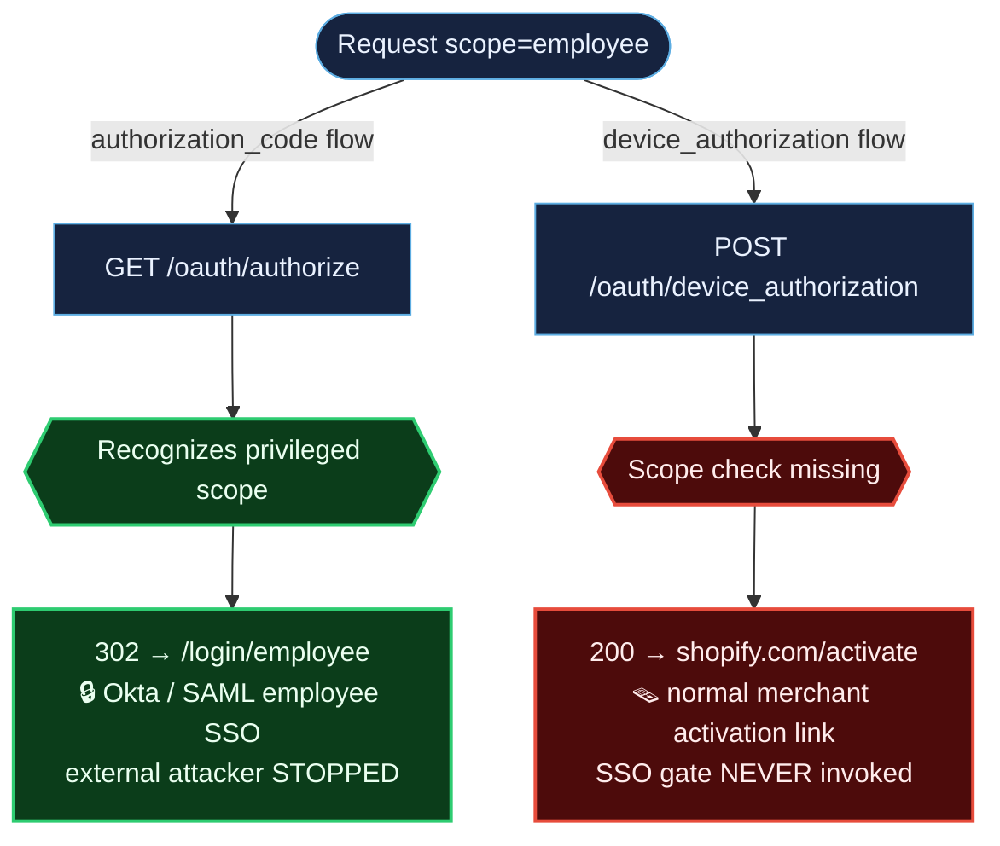
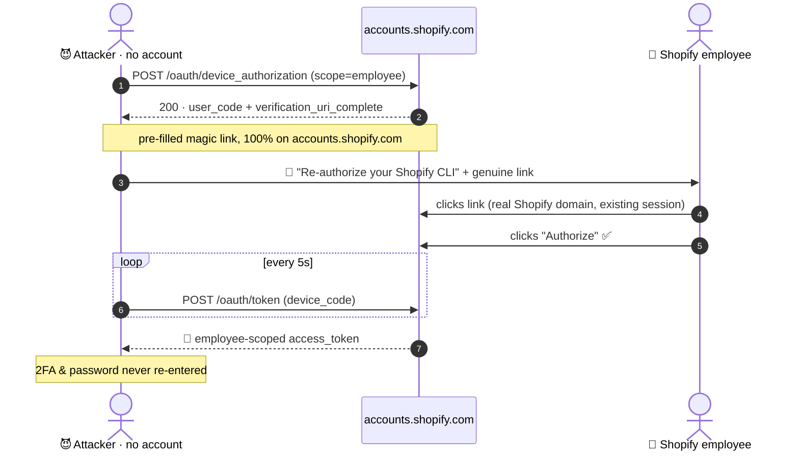

# Case 02 — The Scope That Took the Wrong Door: Shopify's Device-Flow SSO Bypass

**Target:** `accounts.shopify.com` (HackerOne, Core) · **Class:** Missing Authentication
for Critical Function (CWE-306) · **Severity:** High · **CVSS 3.1:** 8.7
(`AV:N/AC:L/PR:N/UI:R/S:C/C:H/I:H/A:N`) · **Status:** reported

> **The one-line lesson:** an OAuth authorization server can expose one privileged scope
> through several grant types. If one grant type routes that scope through a hard gate and
> another doesn't, the soft path *is* the vulnerability. Test every grant type, not just
> the one in the docs.

---

## Background: `employee` is a real, gated scope

Shopify's account server supports a privileged `employee` OAuth scope — a genuine
authentication pathway into internal systems. OIDC discovery confirms it:

```
GET /.well-known/openid-configuration
"scopes_supported": [ ..., "employee", ... ]
```

When you request `scope=employee` through the **standard** `authorization_code` flow, the
server does the right thing: it recognizes the privileged scope and redirects you to a
dedicated internal SSO portal.

```
GET /oauth/authorize?...&scope=employee
→ HTTP 302  Location: https://accounts.shopify.com/login/employee?RelayState=...
```

`/login/employee` requires Shopify employee credentials (Okta/SAML). An external attacker
cannot complete it. **This is the intended access control.**

## The observation that broke it

The same authorization server exposes a **second** grant type — the OAuth 2.0 Device
Authorization Grant — and it is **not** in the discovery document
(`device_authorization_endpoint: null`). Undocumented surface tends to get fewer reviews.
So: request the same privileged scope through *that* door.

```
POST /oauth/device_authorization
client_id=<public Shopify CLI client>&scope=employee

→ HTTP 200
{
  "verification_uri_complete":
    "https://accounts.shopify.com/activate-with-code?device_code[user_code]=SFHQ-ZTPM",
  ...
}
```

No `302` to `/login/employee`. The device flow accepts `scope=employee` and hands back a
**standard merchant activation link** on `accounts.shopify.com` — the employee SSO gate is
never invoked.

### Same scope, two doors



The filtering logic even looks **inverted**: a mundane OIDC scope like `email` is *rejected*
(`400`), while the privileged `employee` scope passes through.

```
employee         → ACCEPTED (user_code issued)   ← bug
employee openid  → ACCEPTED                        ← bug
openid           → ACCEPTED (expected)
email            → REJECTED (400)
```

## Why the impact is real

The device flow's `verification_uri_complete` is a **pre-filled magic link** entirely on
`accounts.shopify.com` — no spoofed domain, no code for the victim to type. An attacker:

1. Mints a `scope=employee` device code (no account needed).
2. Sends a Shopify employee the genuine `accounts.shopify.com/activate-with-code?...` link
   ("Re-authorize your Shopify CLI").
3. Polls `/oauth/token`; the moment the victim clicks **Authorize**, the poll returns an
   `employee`-scoped access token — using the victim's *existing* session, so 2FA and
   password never re-enter the picture.

And there's no rate limiting on `/oauth/device_authorization`, so campaigns scale.

### The attack, end to end



## Honest boundary

The report is careful about what it does **not** prove: it did not access an employee
account or inspect the resulting token's internal claims — that would require a real
Shopify employee account, outside authorized scope. The disclosed bug is the
**authentication-pathway bypass**; Shopify can verify the downstream token internally. That
line — "here is the broken gate; I did not walk through it into your internal systems" — is
what keeps the testing in-scope while still landing a High.

## Reproduce it

One self-contained script, four evidence steps, runs in seconds:

```bash
python3 poc/poc_device_scope_bypass.py
```

Live output for all four steps is in [`poc/output.txt`](poc/output.txt); the full
submission (including the `client_id` provenance from Shopify's open-source CLI) is in
[`original-report.md`](original-report.md).

## Takeaways you can reuse

- **Enumerate grant types, not just endpoints.** `authorization_code`, `device_code`,
  `token-exchange`, `client_credentials` — each is a separate code path to the same scopes.
- **Undocumented endpoints are soft targets.** A capability missing from the discovery doc
  is a capability that may have skipped the security review the documented ones got.
- **Device-code phishing gets nastier with `verification_uri_complete`.** A pre-filled link
  removes the one bit of friction (typing the code) that RFC 9700 relies on. Flag it.
