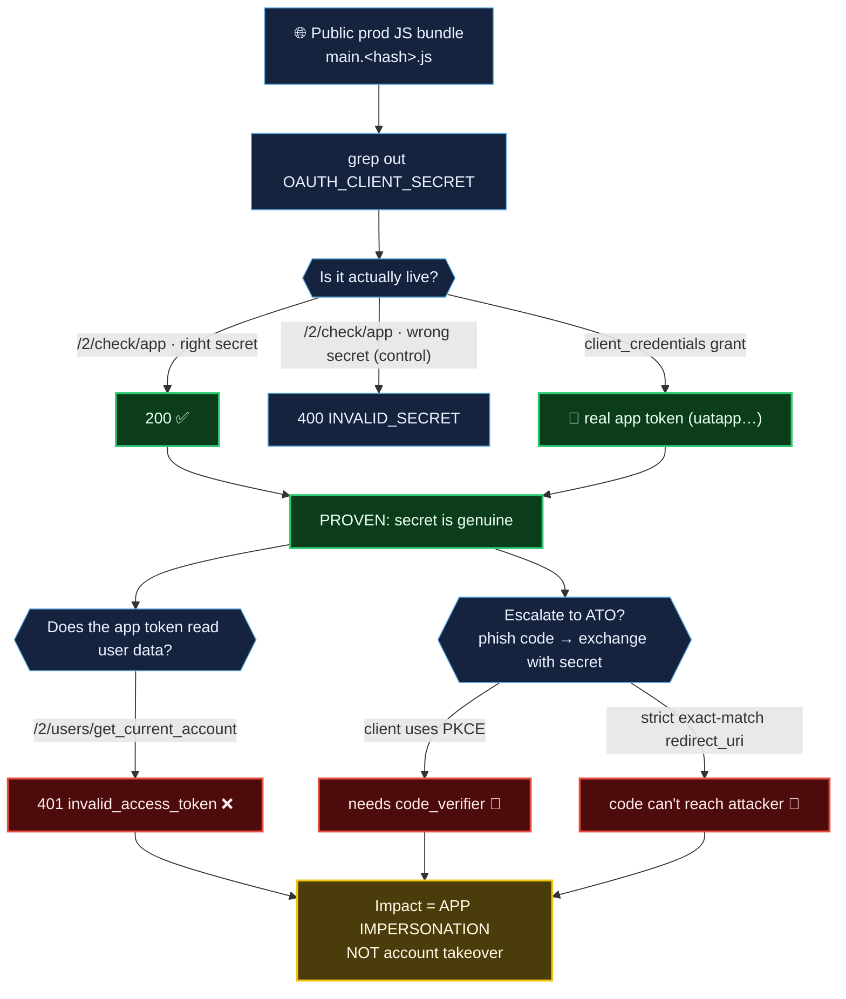

# Case 03 — A Live Secret in Plain Sight: Dropbox Dash's Public `client_secret`

**Target:** `www.dash.ai` (Dropbox, via Intigriti) · **Class:** Exposed production
credential + internal config · **Severity:** P3 / Medium · **Status:** reported

> **The one-line lesson:** finding a secret is the easy 10%. The other 90% is proving it's
> *live* and characterizing *exactly* what it does — and refusing to inflate it into an
> account takeover you can't demonstrate. This case study is here as much for its restraint
> as for its find.

> **Note:** all secret values in this folder are replaced with `REDACTED_*`. The point is
> the method, not the credential.

---

## Background

`www.dash.ai` is a single-page app. Its production JavaScript bundle is downloaded by
every visitor — and it hardcodes the production OAuth `client_id` **and `client_secret`**:

```
$ curl -s https://www.dash.ai/static/js/main.<hash>.js \
    | grep -oE 'OAUTH_CLIENT_(KEY|SECRET):o\([^)]*\)'
OAUTH_CLIENT_KEY:o({DEFAULT:"REDACTED",...,prod:"REDACTED"})
OAUTH_CLIENT_SECRET:o({DEFAULT:"REDACTED",...,prod:"REDACTED"})
```

A `client_secret` in a public SPA is a design error — public clients are supposed to use
PKCE and hold no secret. But "I found a string labeled secret" is not a finding. Proving it
matters is.

### Finding → proof → *honest* impact ceiling



> **The lesson in one picture:** two green boxes prove the secret is real, but four red boxes
> cap the impact. The verdict (amber) is the severity you can *defend* — Medium
> app-impersonation, not the Critical ATO the secret superficially suggests.

## Proving the secret is live (the part most people skip)

Two independent confirmations, each with a **control**:

**1 — App authentication endpoint.** `/2/check/app` returns `200` only for a valid
`client_id:client_secret` pair:

```
$ curl -X POST https://api.dropboxapi.com/2/check/app -u REDACTED_KEY:REDACTED_SECRET ...
200
$ curl -X POST https://api.dropboxapi.com/2/check/app -u REDACTED_KEY:wrongsecret ...
400  {"error_type":"INVALID_SECRET"}
```

The `200`-vs-`400` split is the proof. (The report even calls out a trap: `check/app`
echoes a fixed `"secret":"Super secret string"` constant to *every* caller — that is **not**
the app's secret and proves nothing. Knowing which signal is real is the skill.)

**2 — Token mint.** A `client_credentials` grant with the leaked secret returns a real,
`200` app access token (`uatapp.…`, 4-hour TTL). You cannot mint that without a genuine secret.

## The discipline: what it does NOT do

Here's where the write-up earns its trust. An OAuth secret *sounds* like account takeover.
The author tested that story and **reported it as unproven**:

- The minted token is an **app** token. Point it at user endpoints and it's rejected:
  ```
  POST /2/users/get_current_account → 401 invalid_access_token
  ```
  So the demonstrated impact is **app impersonation**, not user-data access.
- The "phish an auth code → exchange it with the leaked secret → ATO" chain was probed and
  **could not be confirmed**: the client uses **PKCE**, and Dropbox's `authorize` endpoint
  enforces **strict exact-match `redirect_uri`** (suffix-domain, userinfo, and alternate-path
  bypasses all rejected). Two independent controls both hold.

The report's own words: *"this report does not claim ATO."* It states the one experiment
that would settle it (exchange a real code from a consenting account with the secret and no
`code_verifier`) and stops there.

## Bonus from the same bundle

The same public JS leaks a GrowthBook SDK key. One unauthenticated GET returns Dropbox's
internal feature-flag config: **unreleased roadmap flags**, **unreleased AI model names**
(`azure:gpt-5.x`), and ~900 internal customer/team identifiers — deliberately *not*
exfiltrated, only counted. Again: the finding is that sensitive config is in the payload,
not the client-side key itself.

## Reproduce it

Runnable PoCs (secrets redacted) are in [`pocs/`](pocs/); captured request/response
evidence is in [`evidence/`](evidence/); the full write-up with severity reasoning and
timeline is [`original-report.md`](original-report.md).

## Takeaways you can reuse

- **Grep prod JS bundles for `client_secret`, `api_key`, `Authorization`.** SPAs leak more
  than people think — but always confirm *liveness* before you report.
- **Every liveness claim needs a control request.** Right secret `200`, wrong secret `400`.
  Without the negative case you have a coincidence, not a proof.
- **Right-size the severity.** App-impersonation is a Medium; account takeover is a Critical.
  Claiming the Critical you didn't prove gets your whole report distrusted. Footnote the
  escalation, name the missing experiment, submit the severity you can stand behind.
