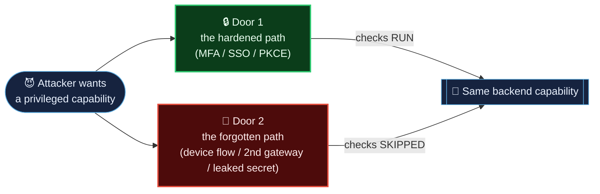
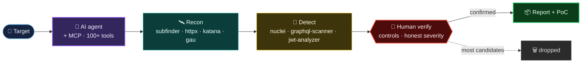

# 🕵️ Bug Bounty Field Notes

### A Master Class in OAuth & GraphQL Auth‑Bypass Hunting

*Three real, responsibly‑disclosed vulnerabilities in the auth layers of major platforms —
taught as case studies, with attack‑flow diagrams and a repeatable methodology.*

 

 

**[The Idea](#-the-through-line)  ·  [The Pipeline](#️-the-pipeline)  ·  [Case Studies](#-case-studies)  ·  [Methodology](methodology/)  ·  [Disclosure Ethics](#-on-secrets-and-disclosure)  ·  [Author](#-author)**

---

> **This isn't a list of findings.** It's a teardown of **how to think** when you hunt OAuth
> and GraphQL systems: how to read the seams between services, how to tell a real break from a
> reflected‑parameter mirage, and how to write up a finding a triager trusts on the first read.

### What you'll learn

- 🚪 **Find the forgotten door** — how the *same* privileged capability gets exposed through a second, unhardened path.
- 🔬 **Diff, don't guess** — using control requests and error‑provenance fields to prove a control was *skipped*, not just that a request failed.
- ⚖️ **Right‑size severity** — proving impact honestly instead of inflating a reflected parameter into "account takeover."
- 📦 **Report like a pro** — one‑command PoCs and write‑ups that get triaged first.

---

## 🎯 The through-line

Every case here comes from the same core idea:

> **The same privileged operation is often reachable through more than one door — and the doors don't enforce the same rules.**

- **Atlassian** — one GraphQL gateway enforces step-up MFA; a second gateway forwards the *same* mutation straight to the backend.
- **Shopify** — the `authorization_code` flow routes a privileged scope through employee SSO; the *device* flow serves it a normal activation link.
- **Dropbox** — a production OAuth `client_secret` is shipped to every browser, and the interesting work is proving *exactly* how far that does — and doesn't — go.

Read **[`methodology/`](methodology/)** first for the repeatable process behind all three.

---

## ⚙️ The Pipeline

These findings didn't come from clicking around — they came out of an **AI‑orchestrated
offensive pipeline**: a language‑model agent driving **100+ security tools** through a single
[MCP](https://modelcontextprotocol.io) server ([HexStrike AI](https://github.com/0x4m4/hexstrike-ai)),
with a human doing the verification and honest severity calls.

**→ Full architecture, stage-by-stage breakdown, and where it paid off on each target: [`pipeline/`](pipeline/)**

---

## 📚 Case studies

| # | Target | Vulnerability class | Severity | The lesson |
|---|--------|--------------------|----------|------------|
| [**01**](01-atlassian-graphql-gateway-bypass/) | 🟦 **Atlassian** | Inconsistent authN/MFA enforcement between GraphQL gateways | `P1` | Read *where* an error comes from, not just its status code |
| [**02**](02-shopify-oauth-device-scope-bypass/) | 🟩 **Shopify** | OAuth device flow bypasses employee SSO gate | `High · CVSS 8.7` | The same scope can take two code paths — test *all* of them |
| [**03**](03-dropbox-oauth-secret-in-public-js/) | 🟦 **Dropbox** | Live production `client_secret` in public JS bundle | `Medium` | Prove impact honestly; a leaked secret is only worth what it actually unlocks |

Each folder contains:
- **`README.md`** — the illustrated case study (start here)
- **`original-report.md`** — the actual write-up submitted to the program
- **`poc/`**, **`evidence/`** — reproduction scripts and captured request/response pairs

---

## 🔒 On secrets and disclosure

Every live credential, token, private key, and API key in this repository has been
**removed or replaced with a `REDACTED_*` placeholder**. Nothing here is a working secret.

All research was performed against assets explicitly in scope for their programs, and
each finding was reported to the vendor before publication. **Findings still inside a
coordinated-disclosure window are deliberately not included here** — responsible
disclosure is part of the craft, not an afterthought.

---

## 👤 Author

**tanmaymish** — independent security researcher (OAuth · GraphQL · web app security).

- 🔗 LinkedIn: `<add your profile link>`
- 🐙 GitHub: [@tanmaymish](https://github.com/tanmaymish)

> ⭐ **If these teardowns helped you learn something, star the repo** — it helps other
> hunters find it, and it makes my day.

---

*For education only. Never run these techniques against systems you are not explicitly authorized to test.*

Licensed under the [MIT License](LICENSE).

