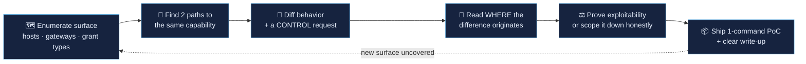

# Methodology — How These Bugs Were Found

The three case studies in this repo look like different bugs on different platforms.
They came from the **same repeatable process**. This is that process.

---

## 1. Map every door to the same room

Modern platforms expose the same backend capability through multiple front doors:

- multiple GraphQL gateways (`home.atlassian.com` vs `admin.atlassian.com`)
- multiple OAuth grant types on one authorization server (`authorization_code` vs `device_code`)
- multiple API hosts (`www.dash.ai` prod vs `staging.dash.ai`)

Security controls are usually implemented **per door**, not per room. So the first
question on any target is never "is this endpoint secure?" — it's:

> **"What *other* way can I reach this same operation, and does that path enforce the same checks?"**

All three findings are answers to that one question.

---

## 2. Diff the behavior, don't just observe it

A single response tells you little. The signal is in the **difference** between two
requests that *should* behave identically:

| Case | Request A | Request B | The tell |
|------|-----------|-----------|----------|
| Atlassian | mutation via `home` gateway | same mutation via `admin` gateway | `errorSource: GRAPHQL_GATEWAY` vs `UNDERLYING_SERVICE` |
| Shopify | `scope=employee` via `authorize` | `scope=employee` via `device_authorization` | `302 → /login/employee` vs `200 → /activate` |
| Dropbox | correct `client_secret` to `/2/check/app` | wrong secret | `200` vs `400 INVALID_SECRET` |

Always build the **control request**. The wrong-secret `400` is what turns "I found a
string that looks like a secret" into "I proved this secret is live." A finding without
its control is a guess.

---

## 3. Read *where* the error comes from

Two `403`s are not the same `403`. In the Atlassian case, the entire finding hinges on a
metadata field (`errorSource`) that reveals **which layer** rejected the request:

- rejected at the **gateway** → the security control ran
- rejected at the **underlying service** → the request sailed past the gateway and the
  backend caught it instead — the gateway control never executed

Status codes lie about location. Error provenance doesn't. Learn to find the field on
your target that tells you *who* answered.

---

## 4. Separate "reachable" from "exploitable" — and never inflate

The fastest way to lose a triager's trust (and your reputation) is to label a reflected
parameter as "account takeover." Discipline:

- A `redirect_uri` **reflected** in a `301` back to the provider's own page is **not** an
  open redirect. Prove the code actually lands on attacker infrastructure, or don't claim it.
- An OAuth `client_secret` in public JS is real — but a `client_credentials` **app** token
  is *rejected* by user endpoints. That makes it app-impersonation, **not** account takeover.
  The Dropbox write-up says exactly that, and says what it would take to prove more.

> Write the severity you can **demonstrate**, footnote the escalation you can't, and state
> the one experiment that would settle it. Honesty is a feature triagers pay for.

---

## 5. Make reproduction free

Every finding here ships a copy-pasteable PoC that runs from a clean machine in seconds.
A triager who can reproduce in one command triages you first. If your PoC needs a five-step
manual setup, it will sit in the queue.

---

## The loop, condensed

That's it. The platforms change; the loop doesn't.
