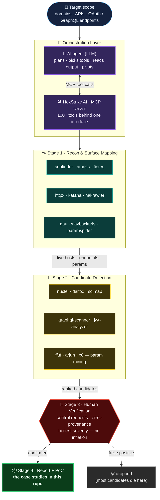

# ⚙️ The Pipeline — How These Findings Were Surfaced

The three case studies in this repo weren't found by clicking around. They came out of an
**AI‑orchestrated offensive pipeline**: a language‑model agent driving **100+ security tools**
through a single [Model Context Protocol (MCP)](https://modelcontextprotocol.io) server, then
handing every candidate to a human for verification and honest severity.

> **The core idea:** let the machine do the tireless part — enumerate surface, fan out tools,
> normalize output — and reserve the human for the part machines are bad at: *judgment*.
> The AI finds "interesting"; the human decides "real."

---

## Architecture

---

## Stage by stage

| Stage | What runs | Output |
|-------|-----------|--------|
| **1 · Recon** | `subfinder`, `amass`, `httpx`, `katana`, `gau`, `waybackurls`, `paramspider` | Live hosts, historical URLs, parameters, JS bundles |
| **2 · Detection** | `nuclei`, `graphql-scanner`, `jwt-analyzer`, `dalfox`, `ffuf`, `arjun`, `x8` | Ranked candidate signals (misconfig, exposed secret, weak scope) |
| **3 · Verification** | **human** + control requests | The 90% cut: kill false positives, prove the real ones |
| **4 · Reporting** | one‑command PoC + write‑up | The case studies you're reading |

The whole thing is glued together by **[HexStrike AI](https://github.com/0x4m4/hexstrike-ai)** —
an open‑source MCP server that exposes a large offensive toolkit to an LLM agent, so the agent
can chain recon → scanning → analysis without a human copy‑pasting between tools.

---

## Where the pipeline actually paid off

- **Dropbox** — Stage 1's JS crawling (`katana` + bundle grep) is what pulled the OAuth
  `client_secret` out of a public production bundle. The pipeline *found the string*; the human
  proved it was **live** and — crucially — proved it **wasn't** account takeover.
- **Atlassian** — Stage 2's `graphql-scanner` hit an **unauthenticated introspection** endpoint,
  which dumped the mutation names. That schema is what made the two‑gateway `errorSource` diff
  testable in the first place.
- **Shopify** — surface enumeration flagged the **undocumented** `device_authorization`
  endpoint (absent from OIDC discovery). Machines are great at noticing "this exists but isn't
  in the docs"; that gap was the whole bug.

---

## The honest part (why this isn't a "scanner spam" repo)

An AI pipeline that reports everything it flags is *noise*. This one is deliberately
**recall‑high, precision‑by‑human**: the machine over‑produces candidates, and **Stage 3 throws
most of them away**. Every finding in this repo survived a control request and a severity
gut‑check. That discipline — not the tool count — is what makes the output worth reading.

> ⚠️ **Use responsibly.** This tooling is powerful and dual‑use. Everything here was run against
> assets explicitly in scope for their bug bounty programs. Point it only at targets you are
> authorized to test.
